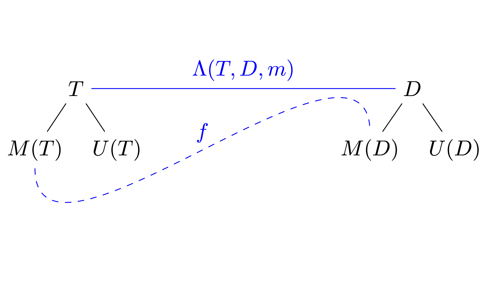
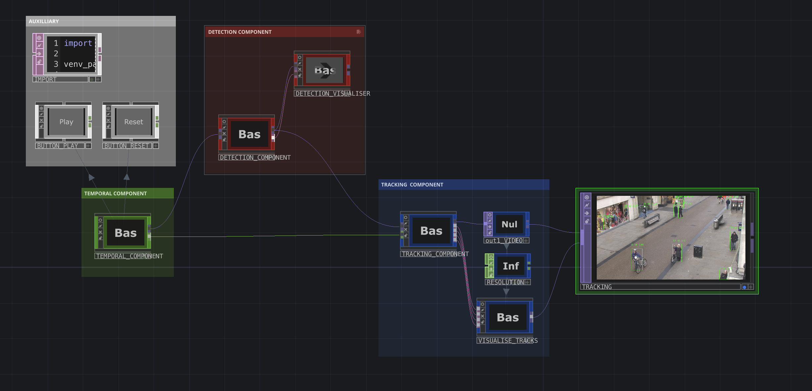

# GenTbD: Generalised Tracking-by-Detection

GenTbD is a Python-based generalised framework for building **tracking-by-detection (TbD) systems**. It provides a modular architecture for combining object detection and tracking, enabling users to create robust tracking pipelines tailored to their needs. Inspired by the techniques implemented in current online TbD Multiple Object Tracking (MOT) algorithms such as [ByteTrack](https://github.com/ifzhang/ByteTrack), [DeepSORT](https://github.com/nwojke/deep_sort), [StrongSORT](https://github.com/dyhBUPT/StrongSORT), [SMILETrack](https://github.com/WWangYuHsiang/SMILEtrack), and [AlphaPose](https://github.com/MVIG-SJTU/AlphaPose).

<div align="center" style="width: 60%; margin: auto;">
   
</div>

---

## Key Features

- **Modular Design**: Easily integrate custom video processors, detectors, and trackers.
- **Generalised Detection**: Supports various detector types (e.g., object detectors, keypoint detectors, Re-ID models) with generalised detections having custom similarity metrics for identity preservation.
- **Track Lifecycle Management**: Implements a clear track lifecycle (`NEW`, `MATCHED`, `LOST`, `RESERVED`) for robust state handling.
- **Cascaded Assignment Algorithm**: Utilises a multi-stage assignment procedure to prioritise high-confidence detections and tracks.
- **Customisable Tracking Logic**: Modify tracking logic, association procedures, and track management to suit specific use cases.

---

## System Overview

The system consists of three core components:

### 1. Temporal
Handles video input and processes each frame. This component is responsible for managing the video source and applying detection and tracking logic frame-by-frame.

- **`Temporal`**: Abstract base class for processing temporal data (e.g., videos). It provides methods for handling video playback, user input events, and frame-by-frame processing.
- **`SimpleVideoProcessor`**: A concrete implementation of `Temporal` that integrates detection and tracking logic. It processes each frame, applies detection and tracking, and displays the results.

### 2. Detector
Performs object detection on video frames. This component abstracts the detection logic and supports various detection models. It also includes the structure and behavior of detections and their properties.

- **`Detector`**: Abstract base class for detectors. Defines the interface for preprocessing, inference, and postprocessing.
- **`YOLOv7ONNX`**: A concrete implementation of `Detector` for the YOLOv7 model in ONNX format. It handles object detection using a pre-trained YOLOv7 model.
- **`Detection`**: Abstract base class for detections. Defines the interface for calculating similarity and visualizing detections.
- **`ObjectDetection`**: A concrete implementation of `Detection` for object detection. It includes properties like bounding boxes, class IDs, and confidence scores.
- **`Property`**: Abstract base class for identity-preserving properties (IPPs) and non-identity-preserving properties (NIPPs). Defines the interface for calculating similarity between properties.
- **`BoundingBox`**: A concrete implementation of `Property` representing a bounding box in 2D space. It supports various formats (e.g., corners, center) and provides methods for calculating IoU.

### 3. Tracker
Manages and updates tracks based on detected objects. This component is responsible for associating detections with existing tracks and managing track states.

- **`Track`**: Represents an individual track (object identity) in the system. It includes attributes like trajectory, Kalman filter, and state transitions.
- **`Trajectory`**: Stores the history of detections associated with a track. It supports querying and managing the trajectory.
- **`KalmanFilter`**: Implements a Kalman filter for smoothing predictions and handling noise in object tracking.
- **`Partition`**: Represents the result of an association procedure, including matched and unmatched tracks/detections.
- **`Tracker`**: Abstract base class for trackers. Defines the interface for association, track management, and lifecycle handling.
- **`SimpleTracker`**: A concrete implementation of `Tracker` that uses cascaded assignment for associating detections with tracks.

---

### Architecture Diagram

***Conceptual architecture diagram constructed as a node network in TouchDesigner.***

---

## Setup Instructions

### Prerequisites

- Python 3.8+
- OpenCV
- NumPy
- ONNX Runtime (for YOLOv7 detector)

### Installation

1. Clone the repository:
   ```bash
   git clone https://github.com/your-repo/GenTbD.git
   cd GenTbD
   ```

2. Install dependencies:
   ```bash
   pip install -r requirements.txt
   ```

3. Download the YOLOv7 ONNX model and place it in the `models/` directory:
   ```bash
   mkdir models
   # Add your model download instructions here
   ```

---

## Usage Guide

### Running the System

1. Place your video file in the `data/` directory.
2. Place your model files (e.g., YOLOv7 ONNX model) in the `models/` directory.
3. Update the `video_file` and `model_file` variables in `src/main.py`:
   ```python
   video_file = "data/your_video.mp4"
   model_file = "models/yolov7.onnx"
   ```
4. Run the main script:
   ```bash
   python src/main.py
   ```

### User Controls

Key events during video processing:
- **`c`**: Toggle between continuous and step-by-step processing modes.
- **`s`**: Save the current frame as an image.
- **`q`**: Quit the video processing.

There are two main track output modes:
- **'state'**: The bounding box colour output is based on the state of the track.

- **'id'**: The bounding box colour output is unique for each track.


---

## File Structure

The project directory is organised as follows:

```
GenTbD/
├── data/                     # Input video files
│   └── your_video.mp4
├── models/                   # Model files
│   └── yolov7.onnx
├── diagrams/                 # Diagrams and images
│   └── GenTbD_architecture.png
├── src/                      # Source code
│   ├── main.py               # Main script
│   ├── Tracking/             # Tracking modules
│   │   ├── Track.py
│   │   ├── Trackers/
│   │   │   └── Tracker.py
│   │   └── Partition.py
│   ├── Detecting/            # Detection modules
│   │   └── Detections/
│   │       └── Detection.py
│   └── Temporal/             # Temporal processing modules
│       ├── Temporal.py
│       └── VideoProcessor.py
├── requirements.txt          # Python dependencies
├── README.md                 # Project documentation
└── LICENSE                   # License file
```

---

## Future Work

- Update requirements and readme.
- Provide detailed documentation for the system.
- Define system parameters for the base version and create a simpler interface.
- Add support for appearance-based tracking using Re-ID models.
- Implement keypoint-based tracking for human pose estimation.
- Introduce weighted sum and gating thresholds for feature fusion.

---

## License
This project is licensed under the MIT License. See the `LICENSE` file for details.
