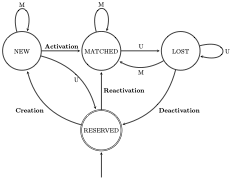
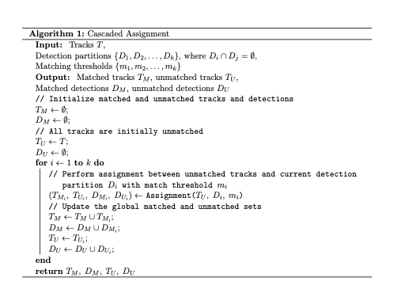
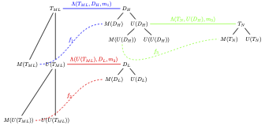

# GenTbD: Generalised Tracking-by-Detection

GenTbD is a Python-based framework for building **tracking-by-detection systems**. It provides a modular architecture for combining object detection and tracking, enabling users to create robust tracking pipelines tailored to their needs. Inspired by prominent online MOT frameworks such as [ByteTrack](https://github.com/ifzhang/ByteTrack), [DeepSORT](https://github.com/nwojke/deep_sort), [StrongSORT](https://github.com/dyhBUPT/StrongSORT), [SMILETrack](https://github.com/WWangYuHsiang/SMILEtrack), and [AlphaPose](https://github.com/MVIG-SJTU/AlphaPose), GenTbD offers an original implementation with a focus on flexibility and extensibility.

---

## Key Features

- **Modular Design**: Easily integrate custom video processors, detectors, and trackers.
- **Generalised Detection**: Supports various detector types (e.g., object detectors, keypoint detectors, Re-ID models) with custom similarity metrics for identity preservation.
- **Track Lifecycle Management**: Implements a clear track lifecycle (`NEW`, `MATCHED`, `LOST`, `RESERVED`) for robust state handling.
- **Cascaded Assignment Algorithm**: Utilises a multi-stage assignment procedure to prioritise high-confidence detections and tracks.
- **Customisable Tracking Logic**: Modify tracking logic, association procedures, and track management to suit specific use cases.

---

## System Overview

The system consists of three core components:

1. **Video Processor**: Handles video input and processes each frame.
2. **Detector**: Performs object detection on video frames.
3. **Tracker**: Manages and updates tracks based on detected objects.

### Architecture Diagram


---

## Setup Instructions

### Prerequisites

- Python 3.8+
- OpenCV
- NumPy
- ONNX Runtime (for YOLOv7 detector)

### Installation

1. Clone the repository:
   ```bash
   git clone https://github.com/your-repo/GenTbD.git
   cd GenTbD
   ```

2. Install dependencies:
   ```bash
   pip install -r requirements.txt
   ```

3. Download the YOLOv7 ONNX model and place it in the `models/` directory:
   ```bash
   mkdir models
   # Add your model download instructions here
   ```

---

## Usage Guide

### Running the System

1. Place your video file in the `data/` directory.
2. Place your model files (e.g., YOLOv7 ONNX model) in the `models/` directory.
3. Update the `video_file` and `model_file` variables in `src/main.py`:
   ```python
   video_file = "data/your_video.mp4"
   model_file = "models/yolov7.onnx"
   ```
4. Run the main script:
   ```bash
   python src/main.py
   ```
### System features

Key events during video processing:
    - **`c`**: Toggle between continuous and step-by-step processing modes.
    - **`s`**: Save the current frame as an image.
    - **`q`**: Quit the video processing.

There are two main track output moded:
    - **'state'**: The bounding box colour outout is based on the state of the track.
    
    - **'id'**: The bounding box colour output is unique for each track.
    

---

## File Structure

The project directory is organised as follows:

```
GenTbD/
├── data/                     # Input video files
│   └── your_video.mp4
├── models/                   # Model files
│   └── yolov7.onnx
├── diagrams/                 # Diagrams and images
│   └── GenTbD_architecture.png
├── src/                      # Source code
│   ├── main.py               # Main script
│   ├── Tracking/             # Tracking modules
│   │   ├── Track.py
│   │   ├── Trackers/
│   │   │   └── Tracker.py
│   │   └── Partition.py
│   ├── Detecting/            # Detection modules
│   │   └── Detections/
│   │       └── Detection.py
│   └── Temporal/             # Temporal processing modules
│       ├── Temporal.py
│       └── VideoProcessor.py
├── requirements.txt          # Python dependencies
├── README.md                 # Project documentation
└── LICENSE                   # License file
```

---

## Features

### Association
Given the use of different detectors, then the need to have variable det
Association is the basis of the tracking algorithm and is used to match tracks (`T`) and detections (`D`). The output of association includes matched tracks (`M(T)`), matched detections (`M(D)`), unmatched tracks (`U(T)`), and unmatched detections (`U(D)`). Matched tracks and detections have a bijective relationship represented by the function `f`.
### Association

Association is the bases of the  tracking algorithm, and is used to match tracks T and detections D. The output of association are the matched tracks M(T) and detections M(D) and the unmatched tracks U(T) and dertections U(D). The matched tracks and detections have a bijective relation represented by the function $f$. 

### Track Lifecycle

After performing association, tracks are partitioned into matched or unmatched categories. Based on this, tracks are defined as a state machine, transitioning between states depending on whether they are matched or unmatched.

A track has the following states:
he track as a state amchine and chaneg the stat edepending on whether or not the track matched or did not match. The followign 
- **Creation**: A track is created when first associated with a detection, marking the start of its identity.
- **Activation**: A track transitions from `NEW` to `MATCHED` when confirmed as a consistent object identity.
- **Deactivation**: If a track fails to reappear after being temporarily lost, it enters the `RESERVED` state, ending active tracking.
- **Reactivation**: A track in the `RESERVED` state can be reactivated if successfully matched with a detection, returning to the `MATCHED` state.- **Activation**: A track transitions from `NEW` to `MATCHED` when confirmed as a consistent object identity.
appear after being temporarily lost, it enters the `RESERVED` state, ending active tracking.
- **Reactivation**: A track in the `RESERVED` state can be reactivated if successfully matched with a detection, returning to the `MATCHED` state.

### Cascaded Assignment

The cascaded assignment algorithm prioritises high-confidence detections and tracks during the matching process, improving accuracy and reducing false positives.### Cascaded Assignment

The cascaded assignment algorithm prioritises high-confidence detections and tracks during the matching process, improving accuracy and reducing false positives.

This is an example of how cascaded assignment works in the ByteTrack algorithm:nment_algo.png)

s is an example of how Cascaded Assignment looks like for the ByteTrack algorithm
---

## Future Work---

- Provide detailed documentation for the system.
- Define system parameters for the base version and create a simpler interface.
- Add support for appearance-based tracking using Re-ID models.
- Implement keypoint-based tracking for human pose estimation.er interface.
- Introduce weighted sum and gating thresholds for feature fusion.- Add support for appearance-based tracking using Re-ID models.
mplement keypoint-based tracking for human pose estimation.
---- Introduce weighted sum and gating thresholds for feature fusion.
This project is licensed under the MIT License. See the `LICENSE` file for details.## License---
This project is licensed under the MIT License. See the `LICENSE` file for details.## License

This project is licensed under the MIT License. See the `LICENSE` file for details.